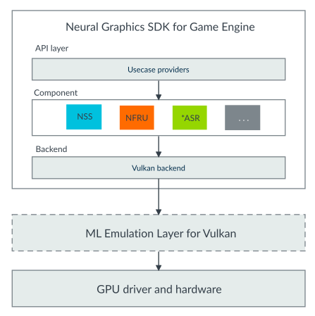
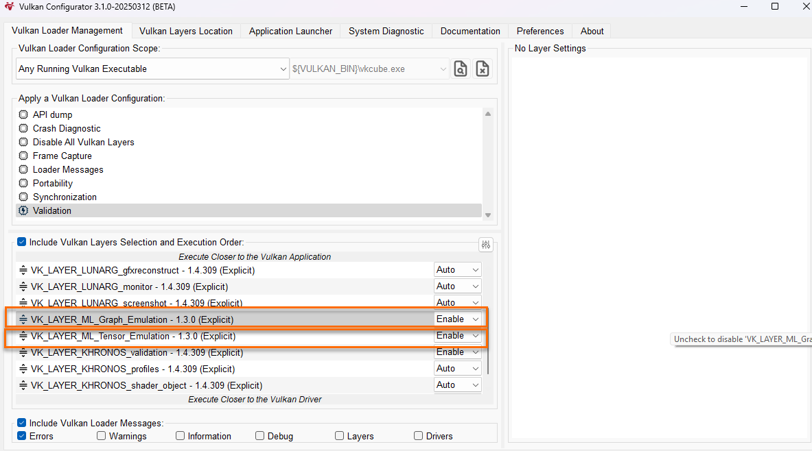
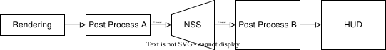
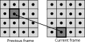

# Arm&reg; Neural Graphics SDK for Game Engines Developer Guide

This document is Non-Confidential.
Copyright &copy; 2025–2026 Arm Limited.

This document is licensed under the Creative Commons Attribution-NoDerivatives 4.0 International License. A copy of the license is available at: https://creativecommons.org/licenses/by-nd/4.0/.

The license permits copying and redistribution of the document, but does not permit adapted versions to be shared, in each case, subject to the terms of the license.

Except for the rights expressly granted under that license, Arm reserves all rights in this document.

The use or implementation of the information contained in this document may be protected by one or more patents or pending patent applications.

The Arm corporate logo and words marked with &reg; or &trade; are registered trademarks or trademarks of Arm Limited or its affiliates in the United States and/or elsewhere. Other brands and names mentioned in this document may be trademarks of their respective owners.
The Creative Commons license does not grant any patent or trademark rights, including permission to use Arm’s trademarks or logos separately from this document or in any manner that suggests that Arm sponsors, endorses or is associated with any person, product or service. This does not prevent Arm’s trademarks or logos from being reproduced as they appear within a copy or extract of the document permitted under the license. References in this document to third-party products or services do not constitute Arm’s approval or endorsement of them.

For guidance on the use of Arm’s trademarks and logos, see Arm’s trademark usage guidelines at https://www.arm.com/company/policies/trademarks.

The content of this document is provided for informational purposes only and is based on information available as at its date of issue. The information, products and solutions described in this document may change without notice, and this document may contain technical inaccuracies or typographical errors.

Users are responsible for compliance with all applicable export control and sanctions laws and regulations. 

The product version is 3.0.
See also: [Revision history](#revision-history) | [Useful resources](#useful-resources)


# Table of contents

- [Introduction](#introduction)
  - [Before you begin](#before-you-begin)
- [Set up your environment](#set-up-your-environment)
  - [Build the SDK](#build-the-sdk)
  - [Integrate the SDK](#integrate-the-sdk)
- [Platform support](#platform-support)
- [Integration](#integration)
  - [Header files](#header-files)
  - [Enable extensions](#enable-extensions)
  - [API interface](#api-interface)
  - [Reset](#reset)
- [ML Emulation Layer for Vulkan](#ml-emulation-layer-for-vulkan)
  - [Before you begin](#before-you-begin-1)
  - [Option 1: Using the Vulkan configurator](#option-1-using-the-vulkan-configurator)
  - [Option 2: Using the libs path](#option-2-using-the-libs-path)
- [Integration guidelines](#integration-guidelines)
  - [API interface commands](#api-interface-commands)
  - [Resources](#resources)
  - [Limitations](#limitations)
- [Neural Super Sampling sample](#neural-super-sampling-sample)
  - [Overview](#overview)
  - [Requirements](#requirements)
  - [Build the sample](#build-the-sample)
  - [Run the sample](#run-the-sample)
  - [User interface elements](#user-interface-elements)
- [Neural Frame Rate Upscaling sample](#neural-frame-rate-upscaling-sample)
  - [Overview](#overview-1)
  - [Requirements](#requirements-1)
  - [Build the sample](#build-the-sample-1)
  - [Run the sample](#run-the-sample-1)
  - [User interface elements](#user-interface-elements-1)
- [Integration checklists](#integration-checklists)
  - [Neural Super Sampling integration checklist](#neural-super-sampling-integration-checklist)
  - [Neural Frame Rate Upscaling integration checklist](#neural-frame-rate-upscaling-integration-checklist)
- [Revision history](#revision-history)
- [Useful resources](#useful-resources)

# Introduction

The Neural Graphics Software Development Kit (SDK) is Arm’s unified SDK for multiple rendering use cases across diverse engines and platforms. The Neural Graphics SDK derives from AMD’s FFX SDK 1.1.3.

The Neural Graphics SDK consolidates Neural Super Sampling (NSS), Arm Accuracy Super Resolution (ASR), and Neural Frame Rate Upscaling (NFRU). It provides a modular, engine-agnostic framework. Currently, the Neural Graphics SDK supports NSS and NFRU.

NSS is Arm's next-generation neural upscaling solution, designed to deliver superior image quality and performance over traditional shader-based methods like Arm ASR. It leverages dedicated neural accelerators to enhance rendering pipelines, particularly for mobile and resource-constrained devices.

NFRU is a deep-learning-based frame interpolation technique that increases delivered frame rate by generating intermediate frames between rendered frames. It combines engine-provided motion vectors, optical-flow-derived correspondence fields, and a neural network to produce temporally consistent and visually smooth interpolated frames. NFRU operates with a known, fixed additional frame of latency, making pacing predictable in real-time graphics on mobile.



*Arm ASR
: The SDK does not support Arm ASR yet. But it will be a fallback for NSS because some devices cannot support ML extensions for Vulkan.

api_layer
: The SDK is compliant with AMD FidelityFX API 1.1.3.

Components
: The SDK supports NSS and NFRU. This layer implements each component independently.

Backend
: All components share one backend. The components access deeper layers using Vulkan APIs.

ML Emulation Layer for Vulkan
: Emulation layers for supporting the ML extensions and Vulkan headers before the real device is ready. For more information, see the [ML Emulation Layer for Vulkan](#ml-emulation-layer-for-vulkan) section.

## Before you begin

This tutorial helps game developers to apply upscaling and frame generation techniques to their projects. After the SDK integration, your project can use NSS for super-resolution and NFRU for frame interpolation during post-processing.

Note:
The SDK is based on the Vulkan API, so this document assumes that readers are familiar with Vulkan.

# Set up your environment

You must have the following software versions installed:

CMake
: Minimum version 3.21, maximum version 3.31

Vulkan SDK
: Recommended version 1.4.321.0

## Build the SDK

This topic explains how to build the SDK using the provided cross-platform build script.

### Procedure

Follow these steps to build the SDK:

1. Ensure you have Python installed.
2. Run the `build.py` cross-platform script to build the SDK.
3. Run the script with `-h` to view detailed usage information.

### Results

If the SDK builds successfully, the build script generates the SDK libraries in the `./bin` folder.

### Next steps

You cannot use these libraries directly. You must integrate the SDK into a project, for example, a game engine. The [Integration guidelines](#integrate-the-sdk) section provides some sample code.

## Integrate the SDK

After you complete the SDK integration, your project can use Neural Super Sampling (NSS) for super-resolution. It can also use Neural Frame Rate Upscaling (NFRU) for frame interpolation during post-processing.

### Procedure

1. To build from source code, copy the SDK folder into your project.
2. Add the SDK as a subproject through `CMakeLists.txt`:

    ```
    add_subdirectory(path/to/sdk)
    ```

3. If you are using prebuilt libraries, you must link them to your project.


# Platform support

The SDK supports various platforms.

The supported platforms are:

- Windows 11 x64
- Linux x64
- Android (Arm validated the SDK on Android 17)

# Integration

This section provides a high‑level workflow for integrating the SDK. It provides information about:

- Which headers to include
- Which Vulkan extensions to enable
- Which API interfaces the SDK includes
- When to reset the context.

The workflow applies to both Neural Super Sampling (NSS) and Neural Frame Rate Upscaling (NFRU).

## Header files

To call the API functions, you must include header files. You must add `#define FFX_CPU` before including the header files so that the SDK can resolve some types in some common headers.

<!-- TODO: Some types and some common headers? -->

### Procedure

Include the following header files:

    #define FFX_CPU
    #include <path/to/sdk/ffx-api/include/ffx_api/ffx_api.hpp>
    #include <path/to/sdk/ffx-api/include/ffx_api/ffx_api_types.h>
    #include <path/to/sdk/ffx-api/include/ffx_api/vk/ffx_api_vk.hpp>

    // Include the component header(s) you need:
    #include <path/to/sdk/ffx-api/include/ffx_api/ffx_nss.hpp>            // for NSS
    #include <path/to/sdk/ffx-api/include/ffx_api/ffx_framegeneration.hpp> // for NFRU

## Enable extensions

The following section shows you how to enable the required Vulkan extensions for the SDK.

When creating Vulkan devices, you must enable the necessary extensions. The required extensions depend on which component you are using:

Table: Required extensions by component

| Extension | NSS | NFRU |
|-----------|:---:|:----:|
| [VK_KHR_synchronization2](https://docs.vulkan.org/refpages/latest/refpages/source/VK_KHR_synchronization2.html) | Required | Required |
| [VK_ARM_tensors](https://docs.vulkan.org/refpages/latest/refpages/source/VK_ARM_tensors.html) | Required | Required |
| [VK_ARM_data_graph](https://docs.vulkan.org/refpages/latest/refpages/source/VK_ARM_data_graph.html) | Required | Required |
| [VK_ARM_data_graph_optical_flow](https://docs.vulkan.org/refpages/latest/refpages/source/VK_ARM_data_graph_optical_flow.html) | — | Required |

You can enable the required extensions in one of two ways:

- **Using `VK_LAYER_ARM_NG`** — The SDK includes a Vulkan layer that automatically injects the required extensions into the device creation call. This approach requires no changes to your application code.
- **Manually in code** — Explicitly enable each extension and feature struct in your `VkDeviceCreateInfo` chain.

#### Option A: Using VK_LAYER_ARM_NG

The SDK includes a Vulkan layer (`VK_LAYER_ARM_NG`). The layer intercepts `vkCreateDevice` and automatically adds the required ML extensions (`VK_ARM_tensors`, `VK_ARM_data_graph`, and `VK_ARM_data_graph_optical_flow`) to `ppEnabledExtensionNames` and the corresponding feature structs to the `pNext` chain. This eliminates the need to modify your device creation code.

The SDK build automatically builds the layer. The SDK puts the layer binary and manifest in the `bin/` output directory with the SDK libraries. The binary is `libVkLayer_arm_NG.so` on Linux and `VkLayer_arm_NG.dll` on Windows.

To activate the layer, set the following environment variables before launching your application:

On Windows:

    set "VK_ADD_LAYER_PATH=path\to\sdk\bin"
    set "VK_INSTANCE_LAYERS=VK_LAYER_ARM_NG"

On Linux:

    export VK_ADD_LAYER_PATH="path/to/sdk/bin"
    export LD_LIBRARY_PATH="path/to/sdk/bin"
    export VK_INSTANCE_LAYERS="VK_LAYER_ARM_NG"

Note:
- If your platform does not natively support the ML extensions, use the ML Emulation Layer for Vulkan and list `VK_LAYER_ARM_NG` above the emulation layers. See [ML Emulation Layer for Vulkan](#ml-emulation-layer-for-vulkan).
- `VK_LAYER_ARM_NG` does not enable `VK_KHR_synchronization2`; you must enable the extension manually, as shown in Option B.
- If your platform does not natively support `VK_KHR_synchronization2`, enable `VK_LAYER_KHRONOS_synchronization2`. For configuration instructions, see the [Synchronization2 layer documentation](https://vulkan.lunarg.com/doc/view/latest/windows/synchronization2_layer.html).

#### Option B: Manually enabling extensions in code

Use the following sample code as guidance to enable your extensions:

    VkDeviceCreateInfo ci = {};
    ci.sType = VK_STRUCTURE_TYPE_DEVICE_CREATE_INFO;
    ... //Other create info settings

    // Required for both NSS and NFRU
    VkPhysicalDeviceSynchronization2FeaturesKHR synchronization2Feature = {};
    {
        synchronization2Feature.sType =
            VK_STRUCTURE_TYPE_PHYSICAL_DEVICE_SYNCHRONIZATION_2_FEATURES_KHR;

        VkPhysicalDeviceFeatures2 features2 = {};
        features2.sType = VK_STRUCTURE_TYPE_PHYSICAL_DEVICE_FEATURES_2;
        features2.pNext = &synchronization2Feature;
        vkGetPhysicalDeviceFeatures2(m_physicalDevice, &features2);

        synchronization2Feature.pNext = const_cast<void*>(ci.pNext);
        ci.pNext = &synchronization2Feature;
    }
    
    // Required for both NSS and NFRU
    VkPhysicalDeviceTensorFeaturesARM tensorFeature = {};
    {
        tensorFeature.sType = VK_STRUCTURE_TYPE_PHYSICAL_DEVICE_TENSOR_FEATURES_ARM;
    
        VkPhysicalDeviceFeatures2 features2 = {};
        features2.sType = VK_STRUCTURE_TYPE_PHYSICAL_DEVICE_FEATURES_2;
        features2.pNext = &tensorFeature;
        vkGetPhysicalDeviceFeatures2(m_physicalDevice, &features2);
    
        tensorFeature.pNext = const_cast<void*>(ci.pNext);
        ci.pNext = &tensorFeature;
    }
    
    // Required for both NSS and NFRU
    VkPhysicalDeviceDataGraphFeaturesARM dataGraphFeature = {};
    {
        dataGraphFeature.sType = 
                              VK_STRUCTURE_TYPE_PHYSICAL_DEVICE_DATA_GRAPH_FEATURES_ARM;
    
        VkPhysicalDeviceFeatures2 features2 = {};
        features2.sType = VK_STRUCTURE_TYPE_PHYSICAL_DEVICE_FEATURES_2;
        features2.pNext = &dataGraphFeature;
        vkGetPhysicalDeviceFeatures2(m_physicalDevice, &features2);
    
        dataGraphFeature.pNext = const_cast<void*>(ci.pNext);
        ci.pNext = &dataGraphFeature;
    }
    
    // Required only for NFRU (optical flow)
    VkPhysicalDeviceDataGraphOpticalFlowFeaturesARM dataGraphOFFeature = {};
    {
        dataGraphOFFeature.sType = 
            VK_STRUCTURE_TYPE_PHYSICAL_DEVICE_DATA_GRAPH_OPTICAL_FLOW_FEATURES_ARM;
    
        VkPhysicalDeviceFeatures2 features2 = {};
        features2.sType = VK_STRUCTURE_TYPE_PHYSICAL_DEVICE_FEATURES_2;
        features2.pNext = &dataGraphOFFeature;
        vkGetPhysicalDeviceFeatures2(m_physicalDevice, &features2);
    
        dataGraphOFFeature.pNext = const_cast<void*>(ci.pNext);
        ci.pNext = &dataGraphOFFeature;
    }
    
    vkCreateDevice(m_physicalDevice, &ci, nullptr, &m_vkdevice)

## API interface

The SDK uses these APIs:

- Create context
- Destroy
- Dispatch
- Query
- Configure

NSS and NFRU both share these APIs. The following sections describe the component-specific descriptors, flags, and parameters.

### Create context

#### Neural Super Sampling

1. To create the NSS context, first generate `ffx::CreateBackendVKDesc` and `ffx::CreateContextDescNss`.

2. Declare an `ffx::Context`, then pass it with the prepared descriptors to `ffx::CreateContext`.

    A successful call creates the NSS context.

For more information and sample code, see the [ffxCreateContext](#ffxcreatecontext) section.

#### Neural Frame Rate Upscaling

1. To create the Neural Frame Rate Upscaling (NFRU) frame generation context, prepare `ffx::CreateBackendVKDesc` and `ffx::CreateContextDescFrameGeneration`.

2. Declare an `ffx::Context`, then pass it with the prepared descriptors to `ffx::CreateContext`.

    A successful call creates the NFRU frame generation context. The SDK also creates and manages two internal contexts: an optical flow context and a frame interpolation context.

For more information and sample code, see the [ffxCreateContext](#ffxcreatecontext) section.

Note:
For both NSS and NFRU, retain the created `ffx::Context` for subsequent dispatch and destruction operations.

### Destroy context

- When the application is terminating, or if you want to destroy the context, call `ffx::DestroyContext`.
- This applies to both NSS and NFRU contexts.
- For more information, see the [ffxDestroyContext](#ffxdestroycontext) section.

### Dispatch

#### Neural Super Sampling

- You must prepare `ffx::DispatchDescNss` for dispatch.
- To run upscaling, call `ffx::Dispatch`.
- For more information and to view the sample code, see the [ffxDispatch](#ffxdispatch) section.

#### Neural Frame Rate Upscaling

- Neural Frame Rate Upscaling (NFRU) dispatch includes two steps: Prepare and Dispatch.
- First, prepare `ffx::DispatchDescFrameGenerationPrepare` and call `ffx::Dispatch` to build internal resources.
- Then, prepare `ffx::DispatchDescFrameGeneration` and call `ffx::Dispatch` to generate the interpolated frame.
- For more information and sample code, see the [ffxDispatch](#ffxdispatch) section.

### Query

#### Neural Super Sampling

- To query Neural Super Sampling (NSS) specific parameters, for example jitter phase count and jitter offsets, call `ffx::Query`.
- For more information and sample code, see the [ffxQuery](#ffxquery) section.

#### Neural Frame Rate Upscaling

- To query Neural Frame Rate Upscaling (NFRU) pipeline stage information, for example to check if stages run as fragment or compute jobs, call `ffx::Query`.
- For more information and sample code, see the [ffxQuery](#ffxquery) section.

### Configure

#### Neural Super Sampling

- To configure a context, call `ffx::Configure`.
- There is no specific context configuration for NSS. For more information, see the [ffxConfigure](#ffxconfigure) section.

#### Neural Frame Rate Upscaling

- To configure the Neural Frame Rate Upscaling (NFRU) context, call `ffx::Configure`.
- NFRU supports enabling or disabling the debug view through `ffx::ConfigureDescFrameGeneration`. For more information, see the [ffxConfigure](#ffxconfigure) section.

## Reset

When the render resolution or the rendered scene changes, reset the SDK context by following the steps in this section. The reset applies to both NSS and NFRU.

### Procedure (Neural Super Sampling example)

1. Destroy the old context.
2. Create a new context with a new render resolution.
3. Set `reset` in `ffx::DispatchDescNss` to true in the next frame's `ffx::Dispatch`.

Note:
For Neural Frame Rate Upscaling (NFRU), set `reset` in `ffx::DispatchDescFrameGeneration` to true on frames where interpolation against the previous frame is invalid. Examples include a camera teleport, a cut-scene cut, or the first frame after a level load.

# ML Emulation Layer for Vulkan

After you integrate the Neural Graphics SDK, you can run Neural Super Sampling (NSS) or Neural Frame Rate Upscaling (NFRU) in your project. If your platform does not support ML extensions for Vulkan, you must enable the ML Emulation Layer for Vulkan.

## Before you begin

Download the [ML Emulation Layer for Vulkan](https://github.com/arm/ai-ml-emulation-layer-for-vulkan/releases).

You can enable the ML Emulation Layer for Vulkan in two ways:

- You can use the "Vulkan configurator" in your Vulkan SDK, see Option 1: Using the Vulkan configurator.
- You can add Vulkan emulation layer libs path to your system environment, see Option 2: Using the libs path.

Choose one method.

Caution:
Whichever method you use, you must enable `VK_LAYER_ML_Graph_Emulation` before you enable `VK_LAYER_ML_Tensor_Emulation`.

Note:
If you are using `VK_LAYER_ARM_NG` (see the [Enable extensions](#enable-extensions) section), list it above the emulation layers in the layer order. For example:

On Windows:

    set "VK_ADD_LAYER_PATH=path\to\sdk\bin;path\to\VulkanML"
    set "VK_INSTANCE_LAYERS=VK_LAYER_ARM_NG;VK_LAYER_ML_Graph_Emulation;VK_LAYER_ML_Tensor_Emulation"

On Linux:

    export VK_ADD_LAYER_PATH="path/to/sdk/bin:path/to/VulkanMLLib"
    export LD_LIBRARY_PATH="path/to/sdk/bin:path/to/VulkanMLLib"
    export VK_INSTANCE_LAYERS="VK_LAYER_ARM_NG:VK_LAYER_ML_Graph_Emulation:VK_LAYER_ML_Tensor_Emulation"

## Option 1: Using the Vulkan configurator

This section describes how to use the Vulkan Configurator in your Vulkan SDK to enable the ML Emulation Layer for Vulkan.

1. Open the Vulkan Configurator.
2. Navigate to the VK_LAYER_ML_Graph_Emulation - 1.3.0 (Explicit) row and select Enable from the drop-down menu.
3. Navigate to the VK_LAYER_ML_Tensor_Emulation - 1.3.0 (Explicit) row and select Enable from the drop-down menu.

{#fig:emulation}

## Option 2: Using the libs path

This section describes how to use the system environment to enable the ML Emulation Layer for Vulkan.

On Windows:

    set "VK_ADD_LAYER_PATH=path\to\VulkanML"
    set "VK_INSTANCE_LAYERS=VK_LAYER_ML_Graph_Emulation;VK_LAYER_ML_Tensor_Emulation"


On Linux:

    export VK_ADD_LAYER_PATH="path/to/VulkanMLLib"
    export LD_LIBRARY_PATH="path/to/VulkanMLLib"
    export VK_INSTANCE_LAYERS="VK_LAYER_ML_Graph_Emulation:VK_LAYER_ML_Tensor_Emulation"

# Integration guidelines

This section provides integration rules, guidelines, best practices, and technical details.

The following image introduces the file structure of the Neural Graphics SDK for Game Engines. The image lists the main files related to Arm Neural Super Sampling (NSS) and Neural Frame Rate Upscaling (NFRU).

    .
    ├── build.py                           #Cross-platform build script.
    ├── Dockerfile                         #Docker build environment.
    ├── ffx-api
    │   ├── include/ffx_api
    │   │   ├── ffx_api.h                  #Core API declarations.
    │   │   ├── ffx_api.hpp                #C++ wrappers for core API.
    │   │   ├── ffx_api_types.h            #Shared types.
    │   │   ├── ffx_nss.*                  #NSS context/dispatch/query descriptors.
    │   │   ├── ffx_framegeneration.*      #NFRU context/dispatch/query descriptors.
    │   │   ├── vk/
    │   │   │   ├── ffx_api_vk.hpp         #Vulkan backend descriptor.
    │   │   ├── ...
    │   ├── src
    │   │   ├── ffx_provider.*             #FFX API provider base class.
    │   │   ├── ffx_provider_nss.*         #NSS provider derived class.
    │   │   ├── ffx_provider_framegeneration.*  #NFRU provider derived class.
    │   │   ├── ...
    ├── sdk
    │   ├── include
    │   │   ├── vulkan-headers             #Vulkan-headers support Arm tensor/graph.
    │   │   ├── FidelityFX
    │   │   |   ├── gpu                    #Header files for shaders.
    │   │   |   ├── host                   #Header files for c++ code.
    │   │   ├── ...
    │   ├── libs
    │   │   ├── SPIRV-Headers              #Submodule, support TOSA 1.0.
    │   │   ├── SPIRV-Tools                #Submodule, support TOSA 1.0.
    │   ├── src
    │   │   ├── backends/vk
    │   │   │   ├── ffx_vk.cpp             #Vulkan backend implementation.
    │   │   │   ├── data_graphs            #Neural network model files (.vgf).
    │   │   │   ├── ...
    │   │   ├── components
    │   │   │   ├── nss                    #NSS algorithm implementation.
    │   │   │   ├── frameinterpolation     #Frame interpolation (part of NFRU).
    │   │   │   ├── opticalflow            #Optical flow (part of NFRU).
    │   │   │   ├── ...
    │   ├── tools                          #These tools will be executed automatically to
    │   │   │                               analyze shaders and model file when running CMake.
    │   │   ├── binary_store               #Pre-built tool binaries.
    │   │   ├── ffx_model_parser           #Model parser.
    │   │   ├── ffx_shader_compiler        #Shader compiler.
    ├── samples                            #Sample applications.
    │   ├── src
    │   │   ├── nss
    │   │   │   ├── nss.cpp                #NSS sample implementation.
    │   │   │   ├── ...
    │   │   ├── nfru
    │   │   │   ├── nfru.cpp               #NFRU sample implementation.
    │   │   │   ├── ...
    │   ├── shaders
    │   │   ├── ...
    ├── layer                              #VK_LAYER_ARM_NG Vulkan layer source.
    │   ├── NGLayer.cpp                    #Layer implementation.
    │   ├── VkLayer_arm_NG.json            #Layer manifest (Linux).
    │   ├── VkLayer_arm_NG_windows.json    #Layer manifest (Windows).

## API interface commands

The Neural Graphics SDK is built based on FFX SDK 1.1.3 APIs. The APIs are declared in `ffx_api.h`.

To learn more about the APIs, see the following functions:

- [ffxCreateContext]
- [ffxDestroyContext]
- [ffxDispatch]
- [ffxQuery]
- [ffxConfigure]

### ffxCreateContext

The `ffxCreateContext` function creates an FFX object context. Depending on the structures provided to this function, `ffxCreateContext` creates the context with the desired version and attributes.

Keep the context that `ffxCreateContext` generates live until you call `ffxDestroyContext`. If `MemCb` is null, the system allocator (malloc/free) is used instead.

#### Neural Super Sampling — ffxCreateContext

##### Placement in the frame

NSS is a temporal upscaling algorithm, so its position in the frame pipeline affects both image quality and performance. Run effects that are safe at render resolution before NSS. Run effects that upscaling can amplify, such as film grain or final presentation effects, after NSS at presentation resolution.



Table: Neural Super Sampling pipeline placement guidance

| Run before NSS at render resolution | Run after NSS at presentation resolution |
|-------------------------------------|------------------------------------------|
| Image-space effects that benefit from lower render cost and do not add unstable high-frequency noise. | Final presentation effects and effects such as film grain or noise that could be amplified by upscaling. |

Sample code:

    ffx::CreateBackendVKDesc backendDesc{};
    backendDesc.header.type = FFX_API_CREATE_CONTEXT_DESC_TYPE_BACKEND_VK;
    backendDesc.vkDevice = getVulkanDevice();
    backendDesc.vkPhysicalDevice = getVulkanPhysicalDevice();
    backendDesc.vkInstance = getVulkanInstance();
    backendDesc.vkDeviceProcAddr = vkGetDeviceProcAddr; //vulkan function pointer
    backendDesc.vkGetInstanceProcAddr = vkGetInstanceProcAddr; //vulkan function pointer
    
    ffx::CreateContextDescNss createContextNss{};
    createContextNss.header.type = FFX_API_CREATE_CONTEXT_DESC_TYPE_NSS;
    createContextNss.maxRenderSize = {initSettings.m_srcRes.x(),
                                     initSettings.m_srcRes.y()};
    createContextNss.maxUpscaleSize = {initSettings.m_targetRes.x(), 
                                      initSettings.m_targetRes.y()};
    createContextNss.flags = 0;
    createContextNss.flags |= (FFX_API_NSS_CONTEXT_FLAG_QUANTIZED |
                           FFX_API_NSS_CONTEXT_FLAG_HIGH_DYNAMIC_RANGE |
                           FFX_API_NSS_CONTEXT_FLAG_DEPTH_INFINITE);
    createContextNss.fpMessage = &nssMsgCallback;
    createContextNss.qualityMode = FFX_API_NSS_SHADER_QUALITY_MODE_QUALITY;
    ffx::ReturnCode retCode = ffx::CreateContext(m_nssContext, nullptr, 
                                                createContextNss, backendDesc);
    

The following list explains the details about the `ffxApiCreateContextDescNss` data structure:

`header.type`
: Must be `FFX_API_CREATE_CONTEXT_DESC_TYPE_NSS`.

`maxRenderSize` and `maxUpscaleSize`
: The SDK supports flexible upscaling ratios. Exact 2x uses the static LUT path with the lowest overhead. Non-2x ratios enable dynamic LUT generation with cost proportional to modulo tile count.

`flags`
: `enum FfxApiCreateContextNssFlags` defines these flags in `ffx-api/include/ffx_api/ffx_nss.h`.

`qualityMode`
: Select shader quality mode. Available presets are Quality (higher image quality), Balanced (bandwidth and performance savings with close quality), and Performance (highest performance with some quality tradeoffs).

`fpMessage`
: A callback function that receives error or warning messages from the runtime. Can be null.

The following table shows the Neural Super Sampling (NSS) context flags.

Table: Create NSS context flags

| Flag Bits                                      | Description                                                                                                                                                            |
| ---------------------------------------------- | ---------------------------------------------------------------------------------------------------------------------------------------------------------------------- |
| FFX_API_NSS_CONTEXT_FLAG_QUANTIZED             | Use a quantized data graph. The SDK quantizes resources to 8 bits. Currently, the SDK only supports quantized data graphs, you must set this bit.                      |
| FFX_API_NSS_CONTEXT_FLAG_HIGH_DYNAMIC_RANGE    | Input color data provided uses a high-dynamic range. Currently this flag must be set.                                                                                  |
| FFX_API_NSS_CONTEXT_FLAG_DEPTH_INVERTED        | Input depth buffer data provided is inverted [1..0].                                                                                                                   |
| FFX_API_NSS_CONTEXT_FLAG_DEPTH_INFINITE        | Input depth buffer data provided is using an infinite far plane.                                                                                                       |
| FFX_API_NSS_CONTEXT_FLAG_RESAMPLE_BICUBIC      | Sample using bicubic filtering.                                                                                                                                        |
| FFX_API_NSS_CONTEXT_FLAG_ALLOW_16BIT           | Runtime allows 16 bit resources to be used.                                                                                                                            |
| FFX_API_NSS_CONTEXT_FLAG_MANAGE_HISTORY        | The SDK allocates and manages previous upscaled color (`outputTm1`) ping-pong textures internally. When not set, the caller must supply `outputTm1` on every dispatch. |
| FFX_API_NSS_CONTEXT_FLAG_PRE_PROCESS_FRAGMENT  | The pre-process shader runs as a fragment job when supported.                                                                                                          |
| FFX_API_NSS_CONTEXT_FLAG_POST_PROCESS_FRAGMENT | The post-process shader runs as a fragment job when supported.                                                                                                         |

#### Neural Frame Rate Upscaling — ffxCreateContext

Sample code:

    ffx::CreateBackendVKDesc backendDesc{};
    backendDesc.header.type = FFX_API_CREATE_CONTEXT_DESC_TYPE_BACKEND_VK;
    backendDesc.vkDevice = getVulkanDevice();
    backendDesc.vkPhysicalDevice = getVulkanPhysicalDevice();
    backendDesc.vkInstance = getVulkanInstance();
    backendDesc.vkDeviceProcAddr = vkGetDeviceProcAddr;
    backendDesc.vkGetInstanceProcAddr = vkGetInstanceProcAddr;
    
    ffx::CreateContextDescFrameGeneration createFg{};
    createFg.displaySize = {m_settings.m_targetRes.x(),
                            m_settings.m_targetRes.y()};
    createFg.renderSize = {m_settings.m_srcRes.x(),
                           m_settings.m_srcRes.y()};
    createFg.backBufferFormat = getSwapChainFormat();
    memcpy(createFg.initialViewProjection,
           &m_settings.m_initialViewProjection.getRow(0)[0],
           sizeof(createFg.initialViewProjection));
    createFg.fpMessage = &nfruMsgCallback;
    createFg.flags = 0;
    createFg.flags |= (FFX_API_FG_CONTEXT_FLAG_ENABLE_HIGH_DYNAMIC_RANGE |
                       FFX_API_FG_CONTEXT_FLAG_ENABLE_DEPTH_INVERTED);
    ffx::ReturnCode retCode = ffx::CreateContext(m_FrameGenContext, nullptr,
                                                createFg, backendDesc);

The following list provides details about the `ffxApiCreateContextDescFrameGeneration` data structure:

`header.type`
: Must be `FFX_API_CREATE_CONTEXT_DESC_TYPE_FRAMEGENERATION`.

`renderSize`
: The resolution at which the application renders the scene, before upscaling. For example `{1280, 720}`.

`displaySize`
: The application presents both rendered and generated frames at this resolution. When you use NFRU standalone it equals `renderSize`. When you use a preceding upscaler, it is larger than `renderSize`.

`backBufferFormat`
: The surface format of the backbuffer. It should match the format reported by your swap chain. The NFRU optical-flow path supports `R8G8B8A8_UNORM`, `B8G8R8A8_UNORM`, `R11G11B10_FLOAT`, and `R8_UNORM`.

`initialViewProjection`
: The initial view-projection matrix. At context creation there is no previous frame yet, so this field seeds the matrix of the frame preceding the first interpolation. Pass the same matrix you will use for the first rendered frame.

`fpMessage`
: A callback function that receives error or warning messages from the runtime. Can be null.

`flags`
: A bitwise-OR of values from `FfxApiCreateContextFramegenerationFlags`. They fall into input-description flags and scheduling flags.

The following table shows the Neural Frame Rate Upscaling (NFRU) context flags.

Table: Create NFRU context flags

| Flag Bits | Description |
|-----------|-------------|
| FFX_API_FG_CONTEXT_FLAG_ENABLE_DISPLAY_RESOLUTION_MOTION_VECTORS | Motion vectors are rendered at display resolution. |
| FFX_API_FG_CONTEXT_FLAG_ENABLE_MOTION_VECTORS_JITTER_CANCELLATION | Motion vectors have the jittering pattern applied to them. |
| FFX_API_FG_CONTEXT_FLAG_ENABLE_DEPTH_INVERTED | Input depth buffer data provided is inverted [1..0]. |
| FFX_API_FG_CONTEXT_FLAG_ENABLE_DEPTH_INFINITE | Input depth buffer data provided is using an infinite far plane. |
| FFX_API_FG_CONTEXT_FLAG_ENABLE_HIGH_DYNAMIC_RANGE | Input color data provided is using a high-dynamic range. |
| FFX_API_FG_CONTEXT_FLAG_WARP_FRAGMENT | Warp stages run as fragment jobs. |
| FFX_API_FG_CONTEXT_FLAG_FILL_HOLES_FRAGMENT | Fill holes stages run as fragment jobs. |
| FFX_API_FG_CONTEXT_FLAG_PRE_PROCESS_FRAGMENT | Pre-process stage runs as a fragment job when supported. |
| FFX_API_FG_CONTEXT_FLAG_POSTPROCESS_FRAGMENT | Post-process stage runs as a fragment job when supported. |
| FFX_API_FG_CONTEXT_FLAG_COPY_DEPTH_FRAGMENT | Copy depth stage runs as a fragment job when supported. |
| FFX_API_FG_CONTEXT_FLAG_DEBUG_VIEW_FRAGMENT | Debug view stage runs as a fragment job when supported. |
| FFX_API_FG_CONTEXT_FLAG_ALL_STAGES_FRAGMENT | Convenience flag that enables fragment jobs for all stages. |
| FFX_API_FG_CONTEXT_FLAG_ALL_STAGES_COMPUTE | Convenience flag (value 0) that keeps all stages as compute jobs. |
| FFX_API_FG_CONTEXT_FLAG_MV_HINTS_FRAGMENT | Motion vector hints will be generated in a fragment shader. |
| FFX_API_FG_CONTEXT_FLAG_MANAGE_PREVIOUS_DEPTH | SDK manages the previous depth internally with ping-pong. When not set, the user must supply `depthTm1` on each dispatch. |
| FFX_API_FG_CONTEXT_FLAG_MANAGE_PREVIOUS_COLOR | SDK manages the previous color internally with ping-pong. When not set, the user must supply `colorTm1` on each dispatch. |

### ffxDestroyContext

The `ffxDestroyContext` function destroys an FFX object context. `MemCb` must be compatible with the callbacks passed to `ffxCreateContext`. This applies to both NSS and NFRU contexts.

Note:
Wait for all GPU work to finish (for example `vkDeviceWaitIdle`) before calling `ffxDestroyContext`.

### ffxConfigure

#### Neural Super Sampling — ffxConfigure

The `ffxConfigure` function configures the provided FFX object context. If the context is null, configure operates on any global state. For Neural Super Sampling (NSS), there is no specific configuration.

#### Neural Frame Rate Upscaling — ffxConfigure

Neural Frame Rate Upscaling (NFRU) uses `ffxConfigure` to enable or disable the debug view.

Sample code:

    ffx::ConfigureDescFrameGeneration configDesc{};
    configDesc.flags = 0;
    if(bEnableDebugView)
    {
        configDesc.flags = FFX_API_FG_DISPATCH_FLAG_DRAW_DEBUG_VIEW;
    }
    ffx::ReturnCode retCode = ffx::Configure(m_FrameGenContext, configDesc);

`header.type`
: Must be `FFX_API_CONFIGURE_DESC_TYPE_FRAMEGENERATION`.

`flags`
: Only the `FFX_API_FG_DISPATCH_FLAG_DRAW_DEBUG_VIEW` flag is supported. Setting the flag enables the debug view. Clearing the flag disables the debug view.

### ffxQuery

#### Neural Super Sampling — ffxQuery

The `ffxQuery` function queries the provided FFX object context. Neural Super Sampling (NSS) provides these query types. The corresponding data structures for queries are defined in `ffx-api/include/ffx_api/ffx_nss.h`.

Table: NSS query types

| Query Type                                       | Data Structure                         | Comments                                                                 |
|--------------------------------------------------|----------------------------------------|--------------------------------------------------------------------------|
| FFX_API_QUERY_DESC_TYPE_NSS_GETJITTERPHASECOUNT  | ffxApiQueryDescNssGetJitterPhaseCount  | Gets the jitter phase count.                                             |
| FFX_API_QUERY_DESC_TYPE_NSS_GETJITTEROFFSET      | ffxApiQueryDescNssGetJitterOffset      | Gets the jitter offset for the specific index.                           |

If context is null, the query operates on any global state. For example, to query a provider ID:

    ffx::QueryDescGetVersions versionQuery{};
    versionQuery.createDescType = FFX_API_CREATE_CONTEXT_DESC_TYPE_NSS;
    uint64_t versionCount = 0;
    versionQuery.outputCount = &versionCount;
    ffxQuery(nullptr, &versionQuery.header); //Null context pointer
 
    std::vector<uint64_t> versionIds;
    std::vector<const char*> versionNames;
    versionIds.resize(versionCount);
    versionNames.resize(versionCount);
    versionQuery.versionIds = versionIds.data();
    versionQuery.versionNames = versionNames.data();
    ffxQuery(nullptr, &versionQuery.header); //Null context pointer

### ffxDispatch

#### Neural Super Sampling — ffxDispatch

For `ffxDispatch` to perform the upscale work, you must call `ffxDispatch` at the end of each frame. This function dispatches work on the given FFX object context defined by the dispatch descriptor. To enable upscale to work properly, you must construct the `ffxApiDispatchDescNss` data structure.

Sample code:

        ffx::DispatchDescNss dispatchNss{};
        dispatchNss.header.type = FFX_API_DISPATCH_DESC_TYPE_NSS;
        dispatchNss.commandList   = static_cast<CommandBufferImpl&>(cmdb).getHandle();
        
        //Get input resources
        dispatchNss.color = getColor;
        dispatchNss.depth = getDepth;
        dispatchNss.motionVectors = getMotion;
        dispatchNss.output = getOutput;

        // Only required when FFX_API_NSS_CONTEXT_FLAG_MANAGE_HISTORY is NOT set.
        // Caller must ping-pong: pass frame N's output as frame N+1's outputTm1.
        dispatchNss.outputTm1 = getPreviousOutput;
        
        dispatchNss.jitterOffset.x      = jitterOffset.x();
        dispatchNss.jitterOffset.y      = jitterOffset.y();
        dispatchNss.renderSize.width    = renderSize.x();
        dispatchNss.renderSize.height   = renderSize.y();
        dispatchNss.upscaleSize.width   = upscaleSize.x();
        dispatchNss.upscaleSize.height  = upscaleSize.y();
        dispatchNss.cameraNear             = cameraNear;
        dispatchNss.cameraFar              = cameraFar;
        dispatchNss.cameraFovAngleVertical = cameraFovAngleVertical;
        dispatchNss.exposure               = exposure;

        // If motion vectors are in UV space and point forward (UV(T+1) = UV(T) + MV).
        // We need to negate and scale by render size to convert from [0,1] UV range to pixel offsets.
        // As NSS expects motion vectors in backward screen-space (UV(T-1) = UV(T) + MV),
        dispatchNss.motionVectorScale.x = -1.0f * maxRenderSize.x(); 
        dispatchNss.motionVectorScale.y = -1.0f * maxRenderSize.y();

        dispatchNss.frameTimeDelta         = frameTimeDelta;
        dispatchNss.reset                  = reset;
        dispatchNss.flags = enableDebugChecking ?
                            FFX_API_NSS_DISPATCH_FLAG_ENABLE_DEBUG_CHECKING : 0;
        dispatchNss.flags = enableDebugView ?
                            FFX_API_NSS_DISPATCH_FLAG_DRAW_DEBUG_VIEW : 0;

        ffx::ReturnCode retCode = ffx::Dispatch(m_nssContext, dispatchNss);


The following list provides details about the `ffx::DispatchDescNss` data structure:

`header.type`
: Must be `FFX_API_DISPATCH_DESC_TYPE_NSS`.

`commandList`
: The command list to record NSS commands into.

`color`
: Render-resolution HDR color resource for the current frame. See the [Providing color and history](#providing-color-and-history) section for details.

`depth`
: Render-resolution depth resource for the current frame. See the [Providing depth buffer](#providing-depth-buffer) section for details.

`motionVectors`
: Render-resolution 2D motion vectors for the current frame. NSS expects backward screen-space motion vectors in the `[-width, -height]` to `[width, height]` range after `motionVectorScale` is applied. See the [Providing motion vectors](#providing-motion-vectors) section for details.

`output`
: Upscaled output resource at `upscaleSize`.

`outputTm1`
: Previous frame's upscaled output. Required when `FFX_API_NSS_CONTEXT_FLAG_MANAGE_HISTORY` is not set. Ignored when `FFX_API_NSS_CONTEXT_FLAG_MANAGE_HISTORY` is set. See the [Providing color and history](#providing-color-and-history) section for details.

`jitterOffset`
: Subpixel jitter offset for the current frame in render-space pixel coordinates. Values must be in the `[-0.5, 0.5]` range. See the [Providing jitterOffset](#providing-jitteroffset) section for details.

`renderSize`
: Resolution at which the current frame was rendered. Must match `color`, `depth`, and `motionVectors`.

`upscaleSize`
: Target upscaled resolution. Must match `output`, `outputTm1`, and `debugViews` when those resources are provided.

`cameraNear`
: Distance to the camera near plane.

`cameraFar`
: Distance to the camera far plane.

`cameraFovAngleVertical`
: Vertical camera field-of-view angle in radians.

`exposure`
: Exposure value used when tonemapping HDR color for model input. This value cannot be zero. See the [Providing exposure value](#providing-exposure-value) section for details.

`motionVectorScale`
: Scale factors used to convert application motion vectors to the NSS expected screen-space range. See the [Providing motion vectors](#providing-motion-vectors) section for details.

`frameTimeDelta`
: Time elapsed since the previous frame, in milliseconds.

`reset`
: Set to true when history is invalid, such as the first frame, camera cuts, teleports, scene changes, or render-size changes.

`flags`
: Dispatch control flags. Can include `FFX_API_NSS_DISPATCH_FLAG_ENABLE_DEBUG_CHECKING` for runtime validation and verbose debug output, or `FFX_API_NSS_DISPATCH_FLAG_DRAW_DEBUG_VIEW` for debug visualization.

`debugViews`
: Optional output resource for debug tiles. Required when `FFX_API_NSS_DISPATCH_FLAG_DRAW_DEBUG_VIEW` is set. Must match `upscaleSize` and use an output-compatible HDR format such as R11G11B10.

`debugViewMode`
: Debug-view mode. `0` renders all 16 diagnostic tiles in a 4x4 grid; `1`-`16` selects one tile fullscreen.

##### Providing jitterOffset

Neural Super Sampling (NSS) replaces a separate TAA pass. The application must apply subpixel jitter to the low-resolution render each frame and pass the matching jitter offset to NSS. The offset must describe the actual render-space pixel displacement introduced by the projection matrix, not the normalized device coordinate adjustment used internally by an engine.

NSS expects jitter offsets in the `[-0.5, 0.5]` range for both axes. Query `FFX_API_QUERY_DESC_TYPE_NSS_GETJITTERPHASECOUNT` for the recommended phase count for the current render/upscale ratio, then query `FFX_API_QUERY_DESC_TYPE_NSS_GETJITTEROFFSET` for the per-frame offset. These queries keep the jitter sequence aligned with NSS temporal expectations.

##### Jitter validation

Use the Neural Super Sampling (NSS) debug view to compare the `low_res_color` and `unjittered_color` tiles. With correct jitter, `low_res_color` shows the expected frame-to-frame shake from the jittered low-resolution render, while `unjittered_color` remains stable. If `low_res_color` appears stable and matches `unjittered_color`, the jitter offset is probably missing, incorrectly signed, or expressed in the wrong coordinate space.

##### Providing exposure value

Neural Super Sampling (NSS) uses the dispatch `exposure` value to tonemap linear HDR input before passing data to the quantized neural model. The value must not be zero and should match the application's tonemapping exposure so NSS sees image detail consistently with the final presentation pipeline.

Poor exposure values can make the preprocessed model input too bright or too dark, reducing detail contrast and causing visible blur or quality loss. If the renderer cannot provide the current frame exposure, tune candidate values experimentally; `e^2` (approximately `7.389056`) is a practical general-purpose starting point.

To validate exposure, enable the NSS debug view and inspect `lr_warped_history` or `unjittered_color`. These tiles show preprocessed color after tonemapping, which helps confirm whether detail contrast is preserved.

When you enable the debug view, the output is a 4x4 grid of diagnostic tiles showing internal NSS signals:

- Row 0: history_color, input_depth, prev_depth, nearest_offset
- Row 1: low_res_color, motion_vector, luma_deriv_tm1, temporal_feedback
- Row 2: lr_warped_history, disocclusion_mask, luma_deriv_t, depth_dilated
- Row 3: unjittered_color, motion_detector, luma_instability, warp_feedback

#### Neural Frame Rate Upscaling — ffxDispatch

Neural Frame Rate Upscaling (NFRU) dispatch has two steps: "prepare dispatch" and "dispatch". The prepare step builds internal resources needed for interpolation. The dispatch step generates the interpolated frame.

A typical per-frame loop:

    // Once, at startup
    ffx::CreateContext(m_FrameGenContext, nullptr, createFg, backendDesc);
    
    // Every frame. frameID must increment by exactly 1.
    for (uint64_t frameID = 0; running; ++frameID)
    {
        renderScene();   // produces depth, motion vectors and color
        upscale();       // optional preceding upscale (e.g. NSS)
    
        // 1) prepare
        ffx::DispatchDescFrameGenerationPrepare prepare{};
        prepare.frameID = frameID;
        // ... fill prepare fields ...
        ffx::Dispatch(m_FrameGenContext, prepare);
    
        // 2) dispatch
        ffx::DispatchDescFrameGeneration dispatch{};
        dispatch.frameID = frameID;   // same frameID as prepare
        // ... fill dispatch fields ...
        ffx::Dispatch(m_FrameGenContext, dispatch);
    
        present(interpolatedFrame);   // generated frame
        present(realFrame);           // rendered frame
    }
    
    // Once, at shutdown
    ffx::DestroyContext(m_FrameGenContext);

##### Neural Frame Rate Upscaling — Prepare dispatch

Sample code:

    ffx::DispatchDescFrameGenerationPrepare dispatchFgPrep{};
    dispatchFgPrep.commandList         = static_cast<CommandBufferImpl&>(cmdb).getHandle();
    dispatchFgPrep.depth               = getDepth;
    dispatchFgPrep.motionVectors       = getMotionVector;
    dispatchFgPrep.jitterOffset.x      = jitterOffset.x();
    dispatchFgPrep.jitterOffset.y      = jitterOffset.y();
    dispatchFgPrep.motionVectorScale.x = motionVectorsScale.x();
    dispatchFgPrep.motionVectorScale.y = motionVectorsScale.y();
    dispatchFgPrep.mvSimilarityThreshold = 0.3f;
    dispatchFgPrep.mvSimilarityNoiseThreshold = 1.0f;
    dispatchFgPrep.frameTimeDelta      = max(deltaTimeMS, 1.0f);
    dispatchFgPrep.cameraFovAngleVertical  = cameraFovV;
    dispatchFgPrep.cameraFar               = cameraFar;
    dispatchFgPrep.cameraNear              = cameraNear;
    dispatchFgPrep.viewSpaceToMetersFactor = 0.f;
    dispatchFgPrep.frameID                 = frameIdx;
    memcpy(dispatchFgPrep.viewProjection, &viewProjection.getRow(0)[0],
           sizeof(FfxApiFloat32x4x4));
    ffx::ReturnCode retCode = ffx::Dispatch(m_FrameGenContext, dispatchFgPrep);

The following table explains the `ffxApiDispatchDescFrameGenerationPrepare` fields:

Table: Neural Frame Rate Upscaling prepare dispatch fields

| Field | Description |
|-------|-------------|
| `header.type` | Must be `FFX_API_DISPATCH_DESC_TYPE_FRAMEGENERATION_PREPARE`. |
| `frameID` | Identifier for internal resources. Must increment by exactly 1 each frame. The prepare and dispatch of the same frame must use the same `frameID`. |
| `commandList` | The command list to record frame generation commands into. |
| `jitterOffset` | The subpixel jitter offset applied to the camera this frame. It follows the same specification as NSS. For more information, see the NSS [Providing jitterOffset](#providing-jitteroffset) section. Currently, NFRU does not use this value during dispatch because jitter cancellation is not implemented. |
| `motionVectorScale` | The scale factor that converts stored motion-vector values into pixel offsets. NFRU follows the same motion-vector scale convention as NSS. For more information, see the NSS [Providing motion vectors](#providing-motion-vectors) section. |
| `mvSimilarityThreshold` | Dynamic-mask similarity threshold. `<= 0` falls back to legacy default `0.3`. |
| `mvSimilarityNoiseThreshold` | Dynamic-mask noise threshold. `<= 0` falls back to legacy default `1.0`. |
| `frameTimeDelta` | Time elapsed since the previous frame, in milliseconds. Clamp to a minimum of `1.0` ms. |
| `cameraNear` | The distance to the camera near plane. |
| `cameraFar` | The distance to the camera far plane. Ignored when `FFX_API_FG_CONTEXT_FLAG_ENABLE_DEPTH_INFINITE` is set. |
| `cameraFovAngleVertical` | The field of view angle (in radians) along the height axis of `renderSize`. |
| `viewSpaceToMetersFactor` | Scale factor converting view-space units to meters. `<= 0` selects the default `1.0`. |
| `depth` | The depth buffer image resource for the current frame. It follows the same depth-buffer specification as NSS. For more information, see the NSS [Providing depth buffer](#providing-depth-buffer) section. |
| `motionVectors` | The motion vector image resource for the current frame. It follows the same motion-vector specification as NSS. For more information, see the NSS [Providing motion vectors](#providing-motion-vectors) section. |
| `viewProjection` | This frame's unjittered ViewProjection matrix (column major). NFRU requires the unjittered version because jitter cancellation is not implemented. |

##### Neural Frame Rate Upscaling — Dispatch

Sample code:

    ffx::DispatchDescFrameGeneration dispatchDesc{};
    dispatchDesc.commandList                = static_cast<CommandBufferImpl&>(cmdb).getHandle();
    dispatchDesc.outputs[0]                 = interpolatedResource;
    dispatchDesc.presentColor               = backbuffer;
    dispatchDesc.reset                      = bReset;
    dispatchDesc.numGeneratedFrames         = 1;
    dispatchDesc.frameID                    = currentFrameID;
    ffx::ReturnCode retCode = ffx::Dispatch(m_FrameGenContext, dispatchDesc);

The following table explains the `ffxApiDispatchDescFrameGeneration` fields:

Table: Neural Frame Rate Upscaling dispatch fields

| Field                | Description                                                                                                                                                                                                                      |
| -------------------- | -------------------------------------------------------------------------------------------------------------------------------------------------------------------------------------------------------------------------------- |
| `header.type`        | Must be `FFX_API_DISPATCH_DESC_TYPE_FRAMEGENERATION`.                                                                                                                                                                            |
| `commandList`        | The command list on which to register frame generation commands.                                                                                                                                                                 |
| `presentColor`       | The current frame's presentation color image (display resolution), typically the swap chain image. The NFRU optical-flow path supports `R8G8B8A8_UNORM`, `B8G8R8A8_UNORM`, `R11G11B10_FLOAT`, and `R8_UNORM` backbuffer formats. |
| `outputs`            | The destination image(s) that receive the generated frame(s). With `numGeneratedFrames = 1`, only `outputs[0]` is used. Use a format compatible with the supported NFRU backbuffer formats.                                      |
| `numGeneratedFrames` | The number of frames to generate. Currently `1`.                                                                                                                                                                                 |
| `reset`              | When true, indicates the camera moved discontinuously. NFRU copies such frames from `presentColor` instead of interpolated.                                                                                                      |
| `frameID`            | Must match the `frameID` used in the prepare dispatch. Must increment by exactly 1 each frame.                                                                                                                                   |

When you use `ffxConfigure` to enable NFRU debug view, the output splits into a 3x3 grid:

- Row 1: depth tm1, depth tp1, disocclusion mask tm1
- Row 2: disocclusion mask tp1, motion warped tm1 color, motion warped tp1 color
- Row 3: OF warped tm1 color, OF warped tp1 color, dynamic mask blended on output color

## Resources

### Fragment pass image usage

When you run Neural Super Sampling (NSS) or Neural Frame Rate Upscaling (NFRU) stages as fragment passes, do not add `VK_IMAGE_USAGE_STORAGE_BIT` to external images. This applies to images that are only sampled or used as color or depth attachments, such as `color`, `depth`, and `motionVectors`. Use attachment and sampled usage flags that match how the application produces and consumes the image, for example `VK_IMAGE_USAGE_COLOR_ATTACHMENT_BIT`, `VK_IMAGE_USAGE_DEPTH_STENCIL_ATTACHMENT_BIT`, and `VK_IMAGE_USAGE_SAMPLED_BIT`.

On Mali GPUs, avoiding unnecessary storage-image usage lets eligible external images keep AFBC compression. Add `VK_IMAGE_USAGE_STORAGE_BIT` only for compute-path resources that must be accessed as storage images.

### Neural Super Sampling resources

The following table lists the details of the input and output resources for Neural Super Sampling (NSS). For fragment-pass integrations, also follow the guidance in [Fragment pass image usage](#fragment-pass-image-usage).

Table: NSS input and output resources

| Resource      | Resolution          | Format    | Data type | Comment                                                                                                                                      |
|---------------|---------------------|-----------|-----------|----------------------------------------------------------------------------------------------------------------------------------------------|
| color         | Render resolution   | R11G11B10 | Float     | The render resolution color buffer for the current frame provided by the application. Must be HDR format.                                    |
| depth         | Render resolution   | R32       | Float     | The render resolution depth buffer for the current frame provided by the application.                                                        |
| motionVectors | Render resolution   | R16G16    | Float     | The 2D motion vectors for the current frame provided by the application in backward screen-space `[-width, -height] to [width, height]` range. |
| output        | Upscaled resolution | R11G11B10 | Float     | Upscaled output.                                                                                                                             |
| outputTm1     | Upscaled resolution | R11G11B10 | Float     | Previous frame's upscaled output. Required when `FFX_API_NSS_CONTEXT_FLAG_MANAGE_HISTORY` is not set. The caller must ping-pong: pass frame N's `output` as frame N+1's `outputTm1`. |
| debugViews    | Upscaled resolution | R11G11B10 | Float     | Optional output resource for debug tiles. Required when `FFX_API_NSS_DISPATCH_FLAG_DRAW_DEBUG_VIEW` is set; should match `output` size and format. |

#### Providing color and history

Neural Super Sampling (NSS) inputs and outputs are linear-space HDR color. The SDK uses R11G11B10 by default for HDR resources because it balances performance and image quality.

R11G11B10 can produce dark speckle artifacts on some hardware because of precision loss when writing color. The SDK includes a post-process workaround. By default, the SDK disables the workaround because the workaround adds shader overhead. Keep the workaround disabled unless you observe shader overhead artifacts.

By default, the application provides both the low-resolution `color` input and the previous high-resolution history texture `outputTm1`. This lets applications manage history with their own ring-buffer or ping-pong mechanism and avoids an internal copy. If the application cannot manage history externally, set `FFX_API_NSS_CONTEXT_FLAG_MANAGE_HISTORY` during context creation so the SDK manages the history ping-pong internally.

#### Providing depth buffer

Arm recommends an inverted, infinite depth buffer for Neural Super Sampling (NSS), but NSS supports other depth configurations. Match the create-context flags to the actual depth buffer supplied by the application.

| Flag | Description |
|------|-------------|
| `FFX_API_NSS_CONTEXT_FLAG_DEPTH_INVERTED` | Input depth buffer data is inverted. |
| `FFX_API_NSS_CONTEXT_FLAG_DEPTH_INFINITE` | Input depth buffer data uses an infinite far plane. |

#### Providing motion vectors

Neural Super Sampling (NSS) expects motion vectors that describe where a current-frame pixel came from in the previous frame. The expected range is backward screen space, `[-width, -height]` to `[width, height]`.



If an application produces motion vectors in another space, such as normalized device coordinates, configure `motionVectorScale` to convert the motion vectors before NSS uses them. To validate motion vectors, enable the NSS debug view and inspect the `luma_instability` tile over several frames. Unusual high-contrast noise, wrong-direction patterns, or temporal incoherence usually indicate an incorrect coordinate space, sign, or scale.

### Neural Frame Rate Upscaling resources

The following table lists the details of the input and output resources for Neural Frame Rate Upscaling (NFRU), organized by dispatch stage. For fragment-pass integrations, also follow the guidance in [Fragment pass image usage](#fragment-pass-image-usage).

Table: NFRU input and output resources

| Resource      | Stage   | Resolution          | Format | Data type | Comment                                                                                                                                      |
|---------------|---------|---------------------|--------|-----------|----------------------------------------------------------------------------------------------------------------------------------------------|
| depth         | Prepare | Render resolution   | R32    | Float     | Depth buffer for the current frame provided by the application.                                                                              |
| motionVectors | Prepare | Render resolution   | R16G16 | Float     | The 2D motion vectors for the current frame provided by the application. UV(T-1) = UV(T+1) + Motion.                                        |
| presentColor  | Dispatch| Display resolution  | BGRA8  | Unorm     | Current frame's presentation color, usually a swap chain image. NFRU supports `R8G8B8A8_UNORM`, `B8G8R8A8_UNORM`, `R11G11B10_FLOAT`, and `R8_UNORM` backbuffer formats. |
| outputs       | Dispatch| Display resolution  | BGRA8  | Unorm     | Destination for the generated frame. Must match presentColor's coordinate system, dimensions, and supported format family.                   |

## Limitations

The SDK has usage limitations.

The SDK only supports quantized data graphs on both Neural Super Sampling (NSS) and Neural Frame Rate Upscaling (NFRU).

# Neural Super Sampling sample

You can run the Neural Super Sampling (NSS) sample project to see how to use NSS for high‑quality temporal upscaling. The sample project is derived from the Khronos Vulkan Samples project.

## Overview

The Neural Super Sampling (NSS) sample renders the Sponza scene at a lower render resolution, determined by the upscale factor. NSS then upscales the Sponza scene to the display resolution.

The program flow of the NSS sample is:

1. The scene pipeline produces low-resolution color, velocity, and depth images.
2. The sample passes these images to NSS dispatch to upscale into a high-resolution output.
3. The sample passes the result to the post-processing pipeline to render the final image to the screen.

You can choose a display mode:

- Final Output
- NSS Debug View

## Requirements

The sample has build and runtime environment requirements.

### Before you begin

The dependencies for this task are:

- CMake 3.16+
- Python 3
- Vulkan SDK (recommended 1.4.321.0)
- On Windows:
  - Visual Studio 2019 or higher
- On Linux:
  - C++20 compiler
  - System packages: `cmake g++ xorg-dev libglu1-mesa-dev libwayland-dev libxkbcommon-dev`
- On Android:
  - Android Studio 2024.2.1+ (recommended)
  - Android NDK r23+
  - Android SDK
  - JDK 21

### About this task

The samples are based on the SDK and must meet all SDK environment prerequisites. For more information, see the [Set up your environment](#set-up-your-environment) section and [Build the SDK](#build-the-sdk) section.

### Procedure

1. Fetch sample dependencies:

    On Windows:

    ```
    powershell -ExecutionPolicy Bypass -File samples/scripts/fetch_sample_dependencies.ps1
    ```

    On Linux:

    ```
    bash samples/scripts/fetch_sample_dependencies.sh
    ```

2. Build the SDK and samples together using the `build.py` script at the repository root with `--build-samples`.

## Build the sample

You can build the sample on a Windows, Linux, or Android platform.

### Windows

To build the sample on a Windows platform:

```
python build.py --clean -t Debug -b vk_windows_x64 --build-samples
```

### Linux

To build the sample on a Linux platform:

```
# Headless / Direct-to-Display (default)
python build.py -t Release -b vk_linux_x64 --build-samples

# Desktop with X11 (XCB) window
python build.py -t Release -b vk_linux_x64 --build-samples --cmake-args="-DVKB_WSI_SELECTION=XCB"

# Desktop with Wayland window
python build.py -t Release -b vk_linux_x64 --build-samples --cmake-args="-DVKB_WSI_SELECTION=WAYLAND"
```

### Android

To build the sample on an Android platform:

```
# Set environment variables
$env:JAVA_HOME = "path\to\jdk21"
$env:NDK_ROOT  = "path\to\ndk"

python build.py --clean -t Release -b vk_android_arm --build-samples
```

## Run the sample

This topic describes how to run the Neural Super Sampling (NSS) sample on different platforms, including command-line options.

### Windows

To run the sample on Windows, use:

```
.\build\Debug\samples\app\bin\debug\AMD64\vulkan_samples.exe sample nss
```

### Linux

To run the sample on Linux, use:

```
# Interactive (desktop, requires an XCB/XLIB/WAYLAND build)
./build_x64/Release/samples/app/bin/release/x86_64/vulkan_samples sample nss

# Headless (no display required, default build)
./build_x64/Release/samples/app/bin/release/x86_64/vulkan_samples \
    sample nss --headless-surface --hideui
```

Note:
On desktop, remember to export the emulation-layer environment variables before running the sample. See the [ML Emulation Layer for Vulkan](#ml-emulation-layer-for-vulkan) section.

### Android

To run the sample on Android, use:

```
# Install the APK
adb install samples/build/android_gradle/app/build/outputs/apk/release/vulkan_samples-release.apk

# Push assets and shaders (required if no device was connected during the build)
adb push samples/assets/scenes/sponza \
    /sdcard/Android/data/com.khronos.vulkan_samples/files/assets/scenes/sponza
adb push samples/assets/fonts \
    /sdcard/Android/data/com.khronos.vulkan_samples/files/assets/fonts
adb push samples/shaders \
    /sdcard/Android/data/com.khronos.vulkan_samples/files/shaders

adb shell "chmod -R 777 /sdcard/Android/data/com.khronos.vulkan_samples/files/assets"
adb shell "chmod -R 777 /sdcard/Android/data/com.khronos.vulkan_samples/files/shaders"

# Launch the NSS sample
adb shell am start-activity \
    -n com.khronos.vulkan_samples/com.khronos.vulkan_samples.SampleLauncherActivity \
    -e sample nss
```

### Command line options

The following tables show the sample command line options and Neural Super Sampling (NSS) sample arguments.

Table: Sample command line options

| Option | Description | Usage |
|---|---|---|
| `--width <pixels>` | Window width | `--width 1920` |
| `--height <pixels>` | Window height | `--height 1080` |
| `--hideui` | Hide UI | `--hideui` |
| `--headless-surface` | Use `VK_EXT_headless_surface` | `--headless-surface` |
| `--stop-after-frame <n>` | Automatically stop after frame N | `--stop-after-frame 300` |
| `--app-arg` | Forward arbitrary `KEY=VALUE` arguments to the selected sample | `--app-arg NSS_ENABLE=0` |

Table: NSS sample arguments

| NSS argument | Description | Usage |
|---|---|---|
| `NSS_ENABLE` | Enable or disable NSS | `--app-arg NSS_ENABLE=0` |
| `NSS_SCALE_FACTOR` | NSS upscale factor in `[1.0, 3.0]` | `--app-arg NSS_SCALE_FACTOR=2.0` |
| `NSS_FLAGS` | NSS create-context override flags (decimal or `0x`-prefixed hex) | `--app-arg NSS_FLAGS=0x1C7` |
| `NSS_QUALITY` | Quality mode: `0`=Quality, `1`=Balanced, `2`=Performance | `--app-arg NSS_QUALITY=1` |
| `NSS_DEBUG_VIEW_MODE` | Debug view tile: `0`=4x4 overview, `1`-`16`=single tile fullscreen | `--app-arg NSS_DEBUG_VIEW_MODE=6` |
| `NSS_USE_FRAGMENT` | Execution path: `0`=compute, `1`=fragment | `--app-arg NSS_USE_FRAGMENT=1` |

### Windows example

An example of how to use command line options on Windows is:

```
# Run with 2x NSS upscaling (960×540 → 1920×1080):
.\build\Debug\samples\app\bin\debug\AMD64\vulkan_samples.exe sample nss --width 1920 --height 1080
# Disable NSS
.\build\Debug\samples\app\bin\debug\AMD64\vulkan_samples.exe sample nss --app-arg NSS_ENABLE=0
```

Note:
NSS is optimized for 2x upscaling. Other scale factors are supported but can have reduced quality.

### Android example

An example of how to use command line options on Android is:

```
adb shell am start -n com.khronos.vulkan_samples/com.khronos.vulkan_samples.SampleLauncherActivity --es cmd "sample\ nss\ --hideui"
adb shell am start -n com.khronos.vulkan_samples/com.khronos.vulkan_samples.SampleLauncherActivity --es cmd "sample\ nss\ --app-arg\ NSS_ENABLE=1,NSS_SCALE_FACTOR=2.0,NSS_FLAGS=0x1C7"
```

## User interface elements

The sample provides display modes and settings to help debug and understand the NSS upscaling pipeline.

The display modes are:

Final Output
: The final upscaled image produced by NSS.

NSS Debug View
: NSS internal visualization. When selected, a Debug View Mode control is shown. `0` = 4x4 tiled overview of all debug tiles. `1`-`16` = single debug tile fullscreen.

### Neural Super Sampling sample settings

The following table shows the Neural Super Sampling (NSS) sample settings.

Table: NSS sample settings

| Setting | Value | Description |
|---|---|---|
| Jitter Scale | 0.0-1.0 | Sub-pixel jitter multiplier (0.0 = off, 1.0 = full) |
| Current Jitter | Read-only | Current frame jitter offset in pixels |
| ScaleFactor | 1.0-3.0 | NSS upscale factor |
| Flags | Depends on `ffx_nss.h` | NSS create-context override flags; if `0`, do not override |
| Render | Read-only | Render resolution (low-res), computed from ScaleFactor |
| Display | Read-only | Display resolution (high-res) |
| LOD Bias | Read-only | Mipmap bias for texture sampling, computed from ScaleFactor |
| NSS Quality Mode | Read-only | Active quality preset |
| Path | Read-only | Active execution path (compute / fragment) |
| NSS Enabled | Read-only | Whether NSS is currently enabled |

# Neural Frame Rate Upscaling sample

You can run the Neural Frame Rate Upscaling (NFRU) sample project to see how to use NFRU for frame interpolation. The sample supports both real-time scene rendering and dataset (EXR) input for NFRU frame interpolation.

## Overview

The Neural Frame Rate Upscaling (NFRU) sample supports two modes, selected automatically at startup:

Real-time mode (default)
: The sample renders the Sponza scene each frame, producing color (R8G8B8A8_UNORM), motion vectors (R16G16_SFLOAT), and depth (D32_SFLOAT) attachments. The camera orbits the scene. NFRU generates an interpolated frame between every two rendered frames.

Dataset mode (when `NFRU_DATASET_DIR` is provided)
: Dataset mode loads dataset parameters from a JSON file. For each step, it loads three EXR files from disk: color, depth, and motion vectors. It copies them to GPU images, then calls NFRU dispatch using the dataset camera parameters. For the dataset format specification, see the [NFRU dataset specification](https://github.com/arm/neural-graphics-model-gym/blob/main/docs/nfru/nfru_dataset_specification.md).

## Requirements

The Neural Frame Rate Upscaling (NFRU) sample has the same build and runtime environment requirements as the NSS sample. For more information, see the [NSS sample Requirements](#requirements) section.

## Build the sample

The same `build.py --build-samples` workflow builds the Neural Frame Rate Upscaling (NFRU) sample with the Neural Super Sampling (NSS) sample together.

## Run the sample

### Windows

To run the sample on Windows, use:

```
.\build\Debug\samples\app\bin\debug\AMD64\vulkan_samples.exe sample nfru
```

### Linux

To run the sample on Linux, use:

```
# Interactive
./build_x64/Release/samples/app/bin/release/x86_64/vulkan_samples sample nfru

# Headless
./build_x64/Release/samples/app/bin/release/x86_64/vulkan_samples \
    sample nfru --headless-surface --hideui
```

### Android

To run the sample on Android, use the same push steps as the NSS sample, then launch with:

```
adb shell am start-activity \
    -n com.khronos.vulkan_samples/com.khronos.vulkan_samples.SampleLauncherActivity \
    -e sample nfru
```

### Command line options

The general sample command line options are the same as listed in the Neural Super Sampling (NSS) sample section. The following table shows the Neural Frame Rate Upscaling (NFRU)-specific arguments.

Table: NFRU sample arguments

| NFRU argument | Description | Usage |
|---|---|---|
| `NFRU_DATASET_DIR` | Path to the dataset directory | `--app-arg NFRU_DATASET_DIR=path\to\dataset` |
| `NFRU_DATASET_SEQUENCE` | Dataset sequence ID | `--app-arg NFRU_DATASET_SEQUENCE=0000` |
| `NFRU_SAVE_EXR` | Save generated frames to EXR files | `--app-arg NFRU_SAVE_EXR=1` |
| `NFRU_ORBIT_SPEED` | Camera rotation speed (degrees per frame) | `--app-arg NFRU_ORBIT_SPEED=2` |
| `NFRU_USE_FRAGMENT` | Execution path: `0`=compute, `1`=fragment | `--app-arg NFRU_USE_FRAGMENT=1` |
| `NFRU_DEBUG_VIEW` | Enable debug view at startup | `--app-arg NFRU_DEBUG_VIEW=1` |

### Windows example

```
# Rotate 1 degree per frame:
.\build\Debug\samples\app\bin\debug\AMD64\vulkan_samples.exe sample nfru --app-arg NFRU_ORBIT_SPEED=1
# Save generated frames to EXR:
.\build\Debug\samples\app\bin\debug\AMD64\vulkan_samples.exe sample nfru --app-arg NFRU_SAVE_EXR=1
# Dataset replay:
.\build\Debug\samples\app\bin\debug\AMD64\vulkan_samples.exe sample nfru --app-arg "NFRU_DATASET_DIR=path\to\dataset,NFRU_DATASET_SEQUENCE=0000"
```

## User interface elements

The Neural Frame Rate Upscaling (NFRU) sample provides the following UI elements:

Table: NFRU UI elements

| Element | Description |
|---|---|
| Mode | Displays `Real-time` or `Dataset`. |
| Path | Displays the selected execution path: `Fragment` or `Compute`. |
| Frame | Real-time: current frame number. Dataset: `current / total` frames. |
| Completed | Dataset mode only. Shown when all replay frames have been dispatched. |
| Frame Generated by NFRU | Shown in green when the displayed frame was produced by NFRU; yellow (`Original`) otherwise. |
| Output / GT | Shown only when `NFRU_SAVE_EXR=1`. Displays the interpolated-output directory (and the ground-truth directory in real-time mode). |
| NFRU Debug View | Enables the NFRU debug visualization. |
| Orbit speed (deg/frame) | Real-time mode only. Slider (0-10) controlling `NFRU_ORBIT_SPEED`. |

# Integration checklists

## Neural Super Sampling integration checklist

Use this checklist to verify your Neural Super Sampling (NSS) integration is complete:

- Enable `VK_ARM_tensors` and `VK_ARM_data_graph` during `VkDevice` creation.
- Define `#define FFX_CPU` before including any SDK header.
- Set `FFX_API_NSS_CONTEXT_FLAG_QUANTIZED` in creation flags (mandatory).
- Set `FFX_API_NSS_CONTEXT_FLAG_HIGH_DYNAMIC_RANGE` (currently mandatory — color input must be HDR).
- Match depth configuration to your depth buffer setup. For more information, see the [Providing depth buffer](#providing-depth-buffer) section.
- Choose `FFX_API_NSS_CONTEXT_FLAG_MANAGE_HISTORY` based on whether the SDK or your app manages ping-pong history textures.
- Provide jitter offsets correctly. For more information, see the [Providing jitterOffset](#providing-jitteroffset) section.
- Provide motion vectors that match the NSS convention. For more information, see the [Providing motion vectors](#providing-motion-vectors) section.
- Apply the jitter-derived mipmap LOD bias to all material textures at render resolution.
- Set `reset = true` on frames with camera discontinuities (teleport, cut, first frame after load).
- Verify that GPU work is finished (for example `vkDeviceWaitIdle`) before calling `ffxDestroyContext`.
- Recreate context when resolution or quality preset changes.

## Neural Frame Rate Upscaling integration checklist

Use this checklist to verify your Neural Frame Rate Upscaling (NFRU) integration is complete:

- Enable `VK_ARM_tensors`, `VK_ARM_data_graph` and `VK_ARM_data_graph_optical_flow` during `VkDevice` creation.
- Define `#define FFX_CPU` before including any SDK header.
- Set `renderSize` and `displaySize` correctly — equal for standalone use, or `renderSize` smaller than `displaySize` when a preceding upscaler (such as NSS) is in use.
- Match `initialViewProjection` in `ffxApiCreateContextDescFrameGeneration` with the VP matrix for the first rendered frame.
- Match `backBufferFormat` with the actual swap chain image format.
- Match `FFX_API_FG_CONTEXT_FLAG_ENABLE_DEPTH_INVERTED` / `FFX_API_FG_CONTEXT_FLAG_ENABLE_DEPTH_INFINITE` to your depth buffer setup.
- Increment `frameID` by exactly 1 each frame. Use the same `frameID` for both the prepare dispatch and the dispatch of the same frame.
- Set `cameraFovAngleVertical` to the FOV along the height axis of `renderSize`. Use the landscape vertical FOV, or portrait horizontal FOV when using swapchain pre-rotation on Android.
- Use a consistent screen-space coordinate system for all inputs: `depth`, `motionVectors`, `presentColor`, `outputs`, and camera parameters. Account for Android swapchain pre-rotation if applicable.
- Set `reset` to `true` for frames with camera discontinuities, such as teleports, cuts, or level loads.
- Pace generated and rendered frames independently in the presentation logic. NFRU adds 1 frame of latency, and the app owns swap chain pacing.
- Wait for GPU work to finish, for example with `vkDeviceWaitIdle`, before calling `ffxDestroyContext`.
- Recreate the context when `renderSize` or `displaySize` changes.

# Revision history 

## Document release information

The Document history table gives the issue number and the released date for each released issue of this document.

Table: Document history

| Issue   | Date            | Confidentiality  | Change                        |
|---------|-----------------|------------------|-------------------------------|
| 0300-03 | 30 July 2026    | Non-Confidential | First release for version 3.0 |
| 0200-02 | 20 January 2026 | Non-Confidential | First release for version 2.0 |
| 0100-01 | 27 October 2025 | Non-Confidential | First release for version 1.0 |

## Change history

The Change history tables describe the technical changes between released issues of this document in reverse order. Issue numbers match the revision history in [Document release information](#document-release-information).

Table: Differences between issue 0200-02 and 0300-03

| Change | Location |
|--------|----------|
| First limited access release for version 3.0. | &dash; |
| Added Neural Frame Rate Upscaling (NFRU) component support. | Introduction |
| Added NFRU header file. | Header files |
| Added `VK_ARM_data_graph_optical_flow` and Neural Engine feature. | Enable extensions |
| Detailed both NSS and NFRU for all five API interfaces. | Integration |
| Updated NSS: quality presets, MANAGE_HISTORY, fragment flags, debug view. Added NFRU: CreateContext, two-step Dispatch, Configure. Added NFRU resources table. Updated file structure with NFRU files. | Integration guidelines |
| Updated sample build flow to use `build.py --build-samples`. Added Linux sample support. Added new NSS command-line options. | NSS sample |
| Added NFRU sample section. | NFRU sample |
| Added NSS and NFRU integration checklists. | Integration checklists |


Table: Differences between issue 0100-01 and 0200-02

| Change                                                    | Location                |
| --------------------------------------------------------- | ----------------------- |
| First limited access release for version 2.0.             | ‐                       |
| Removed the separate Windows and Linux procedures.        | Set up your environment |
| Added new section.                                        | Platform support        |
| Added new section.                                        | Integration             |
| Added new section.                                        | NSS sample              |
| Removed the padding inputs and truncating output section. | ‐                       |
| Updated the file structure.                               | Integration guidelines  |
| Added the SDK usage limitations section.                  | Limitations             |

Table: Issue 0100-01

| Change                                        | Location |
|-----------------------------------------------|----------|
| First limited access release for version 1.0. | ‐        |

# Useful resources

This document contains information that is specific to this product. See the following resources for other useful information.

Arm documents are available on developer.arm.com/documentation.

Confidential documents are only available to licensees, when logged in. Each document link in the following tables provides direct access to the online version of the document.

Table: Useful resources

| Arm product resources                                                                                                     | Document ID              | Confidentiality  |
| ------------------------------------------------------------------------------------------------------------------------- | ------------------------ | ---------------- |
| [Arm&reg; Moving Mobile Graphics](https://developer.arm.com/community/arm-community-blogs/b/mobile-graphics-and-gaming-blog/posts/moving-mobile-graphics) | Moving Mobile Graphics   | Non-Confidential |
